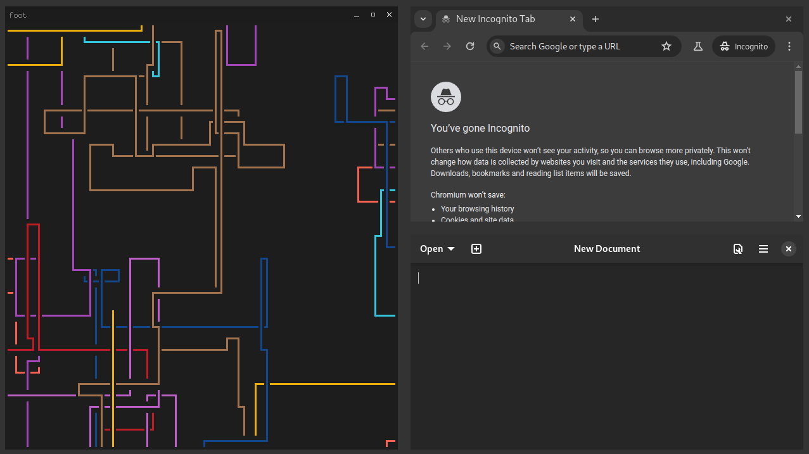

# hyu

A wayland compositor written without dependencies such as libwayland


> Programs running inside hyu

### Running

```sh
cargo run
```

### Running foot inside hyu

```sh
WAYLAND_DISPLAY="wayland-1" foot
```
